# AWS 2-Tier Architecture Project

This project is based on building a basic 2-tier architecture on AWS, where the application and database are hosted on separate EC2 instances.  
The main goal was to understand how real-world deployment works, including networking, security, and connectivity between servers.

---

## Architecture Overview

- Created a custom VPC
- Configured Public and Private Subnets
- Attached Internet Gateway and set up routing
- Used Security Groups for controlled access
- Deployed WordPress on Public EC2 (Application Layer)
- Deployed MySQL on Private EC2 (Database Layer)

---

## What I Implemented

- Set up complete networking (VPC, subnets, routing)
- Launched two EC2 instances
- Installed WordPress on one instance (without local database)
- Installed MySQL on another instance
- Connected WordPress to MySQL using private IP
- Accessed the application using public IP

---

## Challenges Faced

- SSH access and security group configuration
- MySQL remote access setup
- WordPress database connection issues
- Private IP communication between instances

---

## Errors I Debugged

- "Host not allowed to connect"
- "Access denied for user"
- "Error establishing database connection"

Spent time understanding logs, fixing configurations, and testing multiple times to get everything working properly.

---

## What I Learned

- Practical understanding of AWS networking (VPC, Subnets, IGW)
- Importance of Security Groups and access control
- How application and database servers communicate
- Real-world troubleshooting and debugging approach

---

## Tech Stack

AWS VPC | EC2 | Linux | WordPress | MySQL | Networking | SSH

---

## Project Screenshots

### WordPress Setup
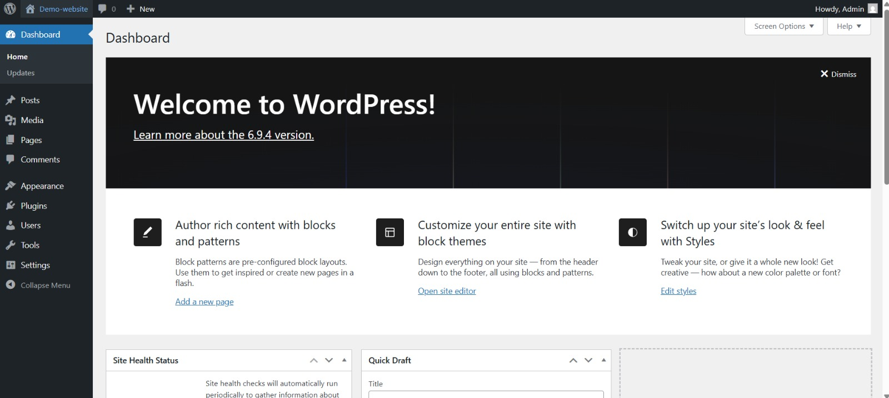

### MySQL Setup
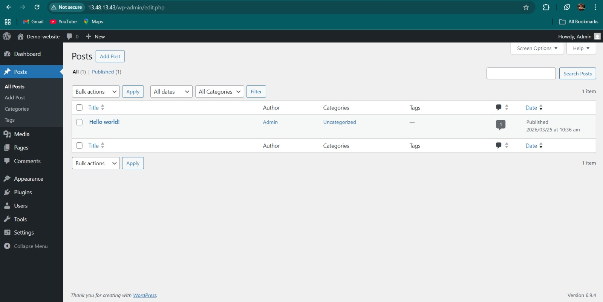

### EC2 Instances

### Security Groups
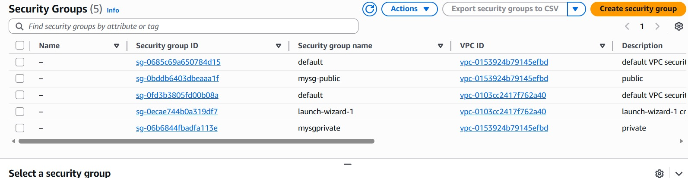

### Additional Screenshots
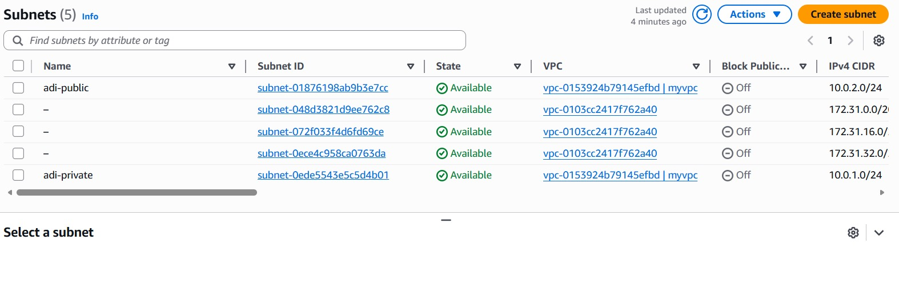
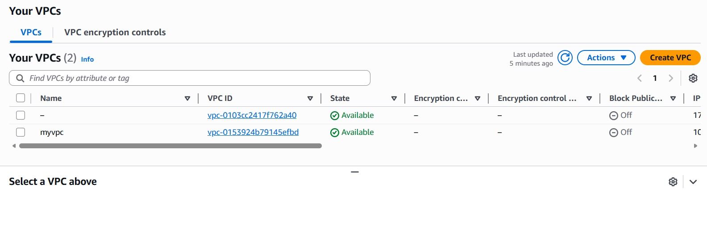
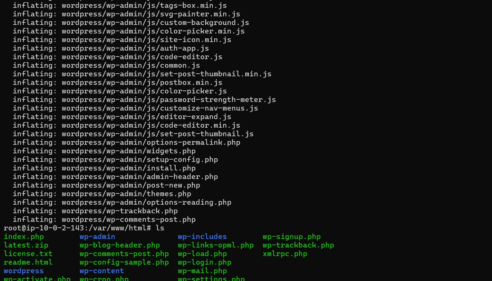

### Database Configuration
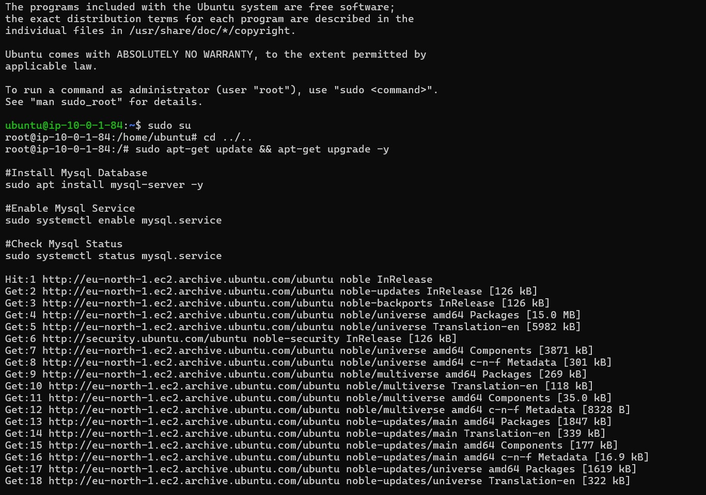
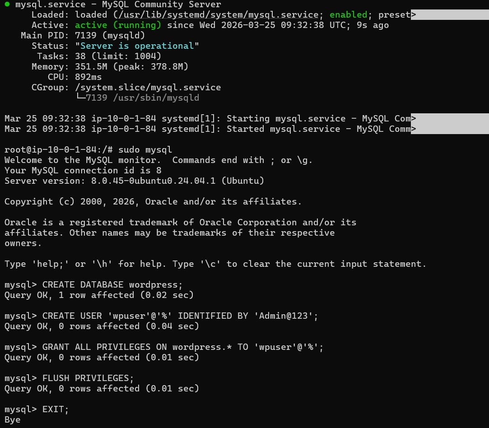
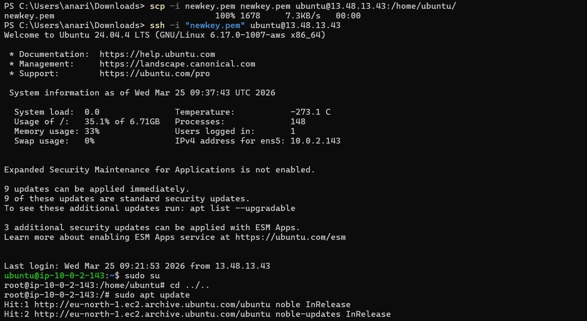
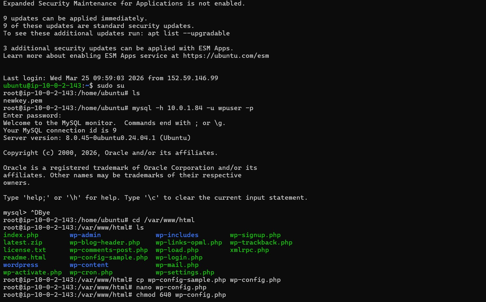
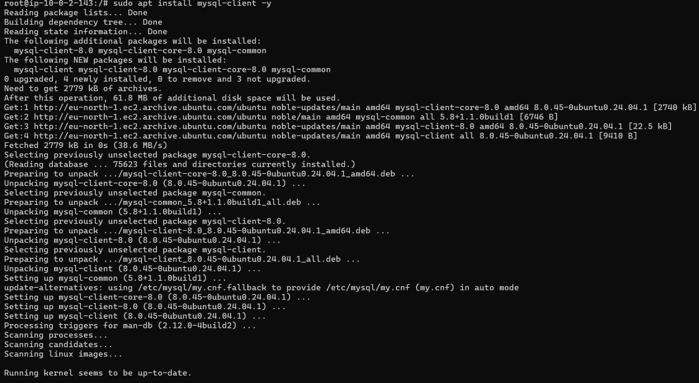
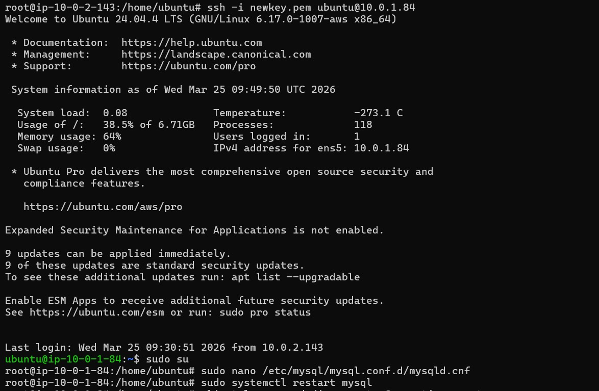

---

## Next Steps

- Implement Load Balancer
- Add Auto Scaling
- Use AWS RDS for managed database